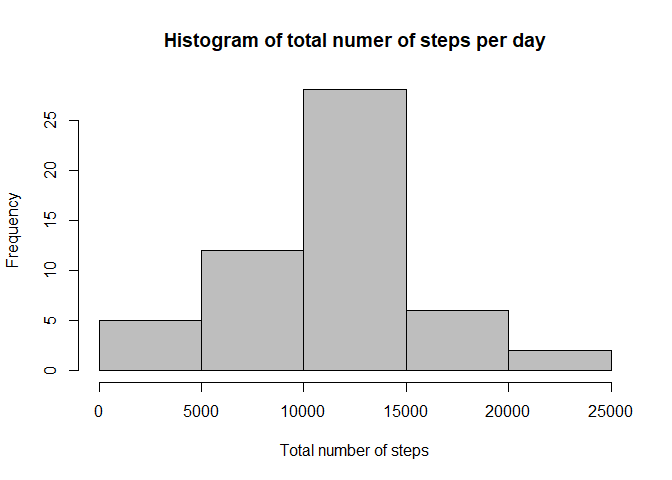
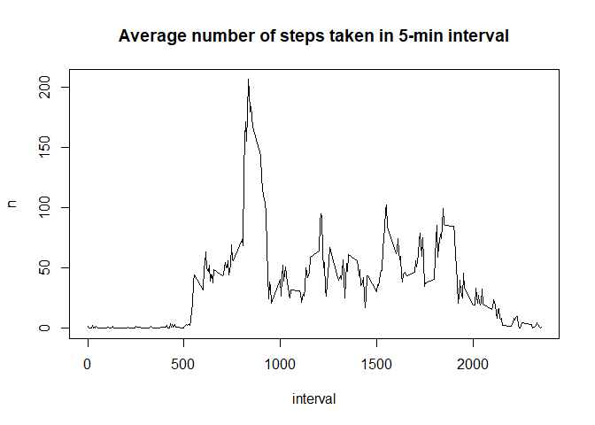
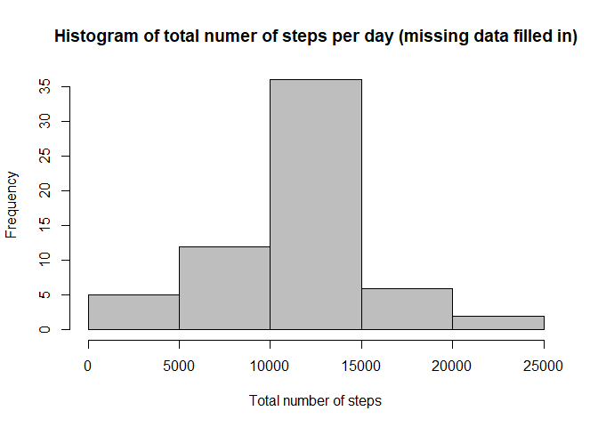

## Loading and preprocessing the data
Repository contains the dataset for the assignment, "activity.zip" so data files have not beed downloaded separately.


```r
unzip("activity.zip")
activity <- read.csv("activity.csv")
head(activity)
```

```
##   steps       date interval
## 1    NA 2012-10-01        0
## 2    NA 2012-10-01        5
## 3    NA 2012-10-01       10
## 4    NA 2012-10-01       15
## 5    NA 2012-10-01       20
## 6    NA 2012-10-01       25
```
## What is mean total number of steps taken per day?

For this part of the assignment, I ignore the missing values in the dataset.

```r
library(dplyr)
total_by_day <- activity %>%
    group_by(date) %>%
    summarise(n = sum(steps))
```


Figure shows a histogram of the total number of steps taken each day.

```r
hist(total_by_day$n, 
     col = "grey", 
     xlab = "Total number of steps", 
     main = "Histogram of total numer of steps per day")
```

<!-- -->


The mean and median total number of steps taken per day are shown below.

```r
mean1 <- mean(total_by_day$n, na.rm = TRUE)
median1 <- median(total_by_day$n, na.rm = TRUE)
mean1
```

```
## [1] 10766.19
```

```r
median1
```

```
## [1] 10765
```


## What is the average daily activity pattern?

The plot below shows the average number of steps taken, averaged across all days (y-axis) by the 5-minute interval (x-axis).


```r
avg_by_int <- activity %>%
    group_by(interval) %>%
    summarise(n = mean(steps, na.rm = TRUE))

with(avg_by_int, plot(interval, n, type = "l",  
                      main="Average number of steps taken in 5-min interval"))
```

<!-- -->

Which 5-minute interval, on average across all the days in the dataset, contains the maximum number of steps?


```r
max_steps <- max(avg_by_int$n)
max_int <- avg_by_int[avg_by_int$n == max_steps, 1]
```
Interval 835 contains the maximum number of steps.

## Imputing missing values

Calculate and report the total number of missing values in the dataset (i.e. the total number of rows with NAs)


```r
count(activity[is.na(activity$steps), ])
```

```
## # A tibble: 1 x 1
##       n
##   <int>
## 1  2304
```

```r
count(activity[is.na(activity$date), ])
```

```
## # A tibble: 1 x 1
##       n
##   <int>
## 1     0
```

```r
count(activity[is.na(activity$interval), ])
```

```
## # A tibble: 1 x 1
##       n
##   <int>
## 1     0
```
Only steps coulumn has NAs so total number of rows with NAs is 2304

All of the missing values in the dataset will be filled with the mean for that 5-minute interval. New dataset equaled to the original datset, but with the missing data filled in is created.


```r
activity_filled <- activity 
activity_filled$avgsteps <- avg_by_int$n
activity_filled[is.na(activity_filled$steps), 1] <- activity_filled[is.na(activity_filled$steps),4]
```

Histogram of the total number of steps taken each day with missing data filled in.


```r
total_by_day <- activity_filled %>%
    group_by(date) %>%
    summarise(n = sum(steps))
```
Figure shows a histogram of the total number of steps taken each day.

```r
hist(total_by_day$n, 
     col = "grey", 
     xlab = "Total number of steps", 
     main = "Histogram of total numer of steps per day (missing data filled in)")
```

<!-- -->

The mean and median total number of steps taken per day are shown below.

```r
mean2 <- mean(total_by_day$n)
median2 <- median(total_by_day$n)
mean2
```

```
## [1] 10766.19
```

```r
median2
```

```
## [1] 10766.19
```
The difference in mean and median total number of steps between original dataset (with missing values ignored) and new dataset (with missing data filled in with average number of steps in inteval): 


```r
mean1 - mean2
```

```
## [1] 0
```

```r
median1 - median2
```

```
## [1] -1.188679
```

## Are there differences in activity patterns between weekdays and weekends?

I use the dataset with the filled-in missing values for this part.

Create a new factor variable in the dataset with two levels – “weekday” and “weekend” indicating whether a given date is a weekday or weekend day.


```r
Sys.setlocale("LC_ALL","English") # I have Russian locale
```

```
## [1] "LC_COLLATE=English_United States.1252;LC_CTYPE=English_United States.1252;LC_MONETARY=English_United States.1252;LC_NUMERIC=C;LC_TIME=English_United States.1252"
```

```r
activity_filled$wday <- weekdays(as.Date(activity_filled$date))
activity_filled$wday <- ifelse(activity_filled$wday %in% c("Saturday", "Sunday"), "weekend", "weekday")

activity_filled$wday <- as.factor(activity_filled$wday)

avg_by_wday <- activity_filled %>%
    group_by(interval, wday) %>%
    summarise(steps = mean(steps))

library(lattice)
xyplot(steps ~ interval | wday, data = avg_by_wday, layout = c(1, 2), type = "l") 
```

<!-- -->
